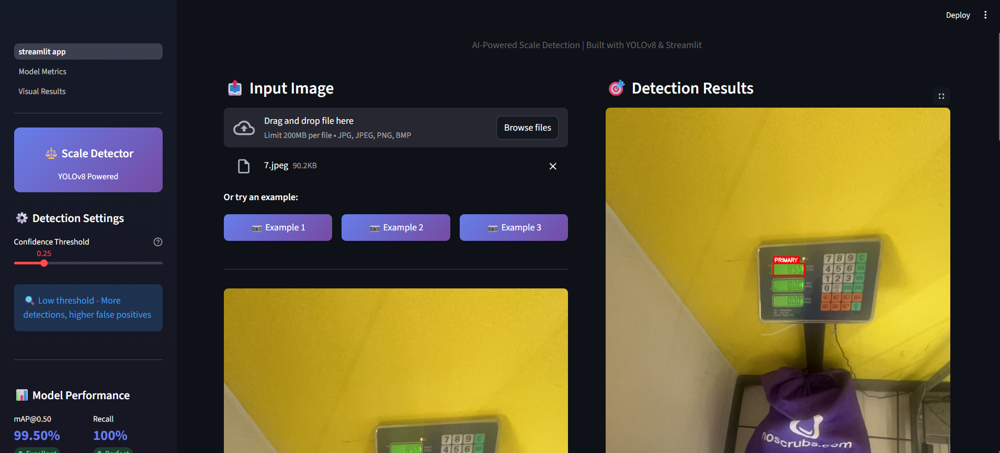
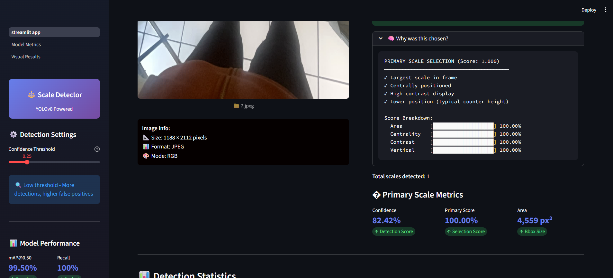
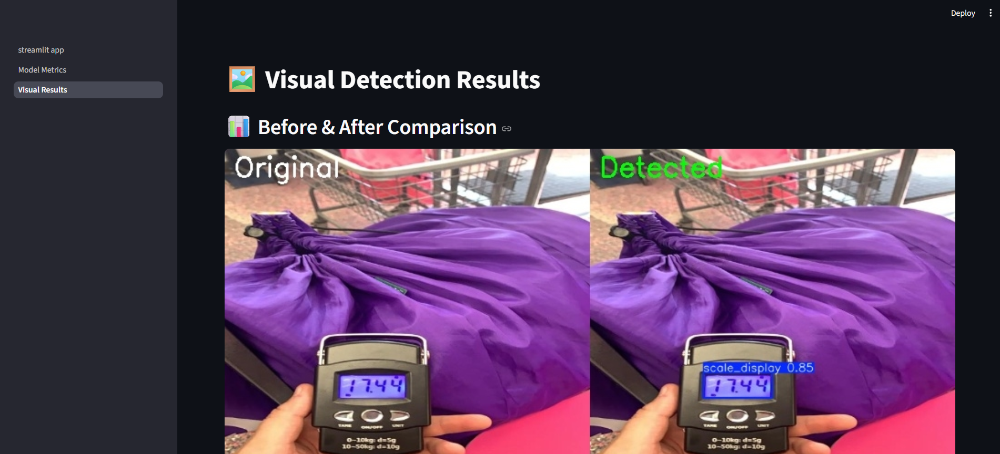

# ⚖️ Weighing Scale Detection  
**End-to-End Weighing Scale Display Detection using YOLOv8**

An AI-powered computer vision system that detects **weighing scale digital displays** from images using a fine-tuned **YOLOv8** model.  
The project includes **training, evaluation, batch inference, visualization, and a production-ready Streamlit web app**.

---

### Streamlit Web Application

**Main Interface - Detection Results**

*Upload images and get real-time detection with adjustable confidence threshold. Primary scale highlighted in red.*

**Primary Scale Detection with Metrics**

*Advanced primary scale identification with detailed explanation and scoring breakdown.*

**Visual Results Comparison**

*Side-by-side comparison showing original image and detected scale display with bounding box.*

---

## 🎯 Features

- 📷 **Weighing Scale Display Detection**  
  Fine-tuned YOLOv8 model trained to localize digital scale displays with high precision.

- 🚀 **High Accuracy Model**  
  - **mAP@0.50:** 99.5%  
  - **Precision:** 99.17%  
  - **Recall:** 100%

- 🧠 **End-to-End ML Pipeline**
  - Data exploration & labeling
  - Model training & evaluation
  - Inference (single image / batch)
  - Result visualization & reporting

- 🖼️ **Rich Visual Outputs**
  - Bounding box annotations
  - Confidence scores
  - Before vs After comparison grids

- 🌐 **Interactive Streamlit Web App**
  - Drag & drop image upload
  - Adjustable confidence threshold
  - Detection statistics & metrics
  - Download annotated images and JSON results

- 📦 **Production-Ready Codebase**
  - Modular Python package
  - CLI inference scripts
  - Reproducible evaluation
  - Clean project structure

---

## 🛠️ Tech Stack

**Computer Vision & Deep Learning**
- Ultralytics YOLOv8
- OpenCV
- PyTorch (via Ultralytics)

**Data & Visualization**
- NumPy
- Pandas
- Matplotlib / Seaborn
- Plotly (metrics dashboard)

**Web & Deployment**
- Streamlit

**Experimentation**
- Jupyter Notebook
- Roboflow (dataset management)

---

## 📊 Model Performance

| Metric | Value |
|------|------|
| mAP@0.50 | **99.5%** |
| mAP@0.50–0.95 | 79.78% |
| Precision | **99.17%** |
| Recall | **100%** |
| F1 Score | **0.9958** |
| Inference Speed | ~10.8 ms / image |
| Throughput | ~64 FPS |

---

## 📦 Installation

### Prerequisites
- Python **3.8+**
- pip package manager

### Setup

```bash
git clone https://github.com/Priyanshu1303d/weighing-scale-detection.git
cd weighing-scale-detection
````

Create virtual environment:

```bash
python -m venv .venv
```

Activate:

**Windows**

```bash
.venv\Scripts\activate
```

**Linux / macOS**

```bash
source .venv/bin/activate
```

Install dependencies:

```bash
pip install -r requirements.txt
```

---

## 🚀 Usage

### 1️⃣ Run Streamlit Web App

```bash
streamlit run app/streamlit_app.py
```

Features:

* Upload images
* Adjust confidence threshold
* View detections & metrics
* Download results (Image + JSON)

---

### 2️⃣ Inference via CLI

**Single Image**

```bash
python scripts/inference.py --input test.jpg
```

**Directory of Images**

```bash
python scripts/inference.py --input data/labeled/test/images --save-json
```

**Custom Confidence Threshold**

```bash
python scripts/inference.py --input test.jpg --conf 0.5
```

---

### 3️⃣ Train Model

```bash
python scripts/train.py
```

Outputs:

* Trained weights → `models/scale_detection_v1/weights/best.pt`
* Training plots & logs

---

### 4️⃣ Evaluate Model

```bash
python scripts/evaluate.py
```

Generates:

* Detailed evaluation metrics
* JSON report
* Performance plots

---

### 5️⃣ Quick Sanity Test

```bash
python scripts/quick_test.py
```

---

## 📁 Project Structure

```
weighing-scale-detection/
│
├── app/                          # Streamlit web application
│   ├── streamlit_app.py
│   └── pages/
│       ├── 1_Model_Metrics.py
│       └── 2_Visual_Results.py
│
├── src/weighing_scale_detection/  # Core detection package
│   ├── detector/
│   │   └── scale_detector.py
│   └── utils/
│       ├── image_utils.py
│       └── visualization.py
│
├── scripts/                      # Training & inference scripts
│   ├── train.py
│   ├── evaluate.py
│   ├── inference.py
│   ├── quick_test.py
│   └── create_comparison.py
│
├── data/
│   ├── raw/
│   └── labeled/
│
├── models/                       # Trained YOLO weights
│
├── results/
│   ├── predictions/
│   ├── metrics/
│   └── visualizations/
│
├── notebooks/                    # Experiments & analysis
├── requirements.txt
├── setup.py
├── LICENSE
└── README.md
```

---

## 🔍 How It Works

1. **Detection**

   * YOLOv8 model detects scale display bounding boxes
   * Confidence-based filtering applied

2. **Post-processing**

   * Bounding box extraction
   * Area, center & confidence computation

3. **Visualization**

   * Annotated images
   * Comparison grids
   * Metrics dashboards

4. **Deployment**

   * Streamlit frontend for real-time inference
   * CLI scripts for batch & production use

---

## 🧪 Testing & Development

* Enable fast testing using small test subsets
* Use `quick_test.py` for sanity checks
* Inspect JSON outputs for automation pipelines

---

## 🤝 Contributing

Contributions are welcome.

1. Fork the repository
2. Create a feature branch
3. Commit changes
4. Open a Pull Request

---

## 📝 License

This project is licensed under the **MIT License**.
See the `LICENSE` file for details.

---

## 🙏 Acknowledgments

* Ultralytics for YOLOv8
* Roboflow for dataset tooling
* Streamlit for rapid ML deployment

---

## 📧 Contact

For questions or collaboration, open a GitHub issue
or reach out via email.

**Made by Priyanshu Kumar Singh**

